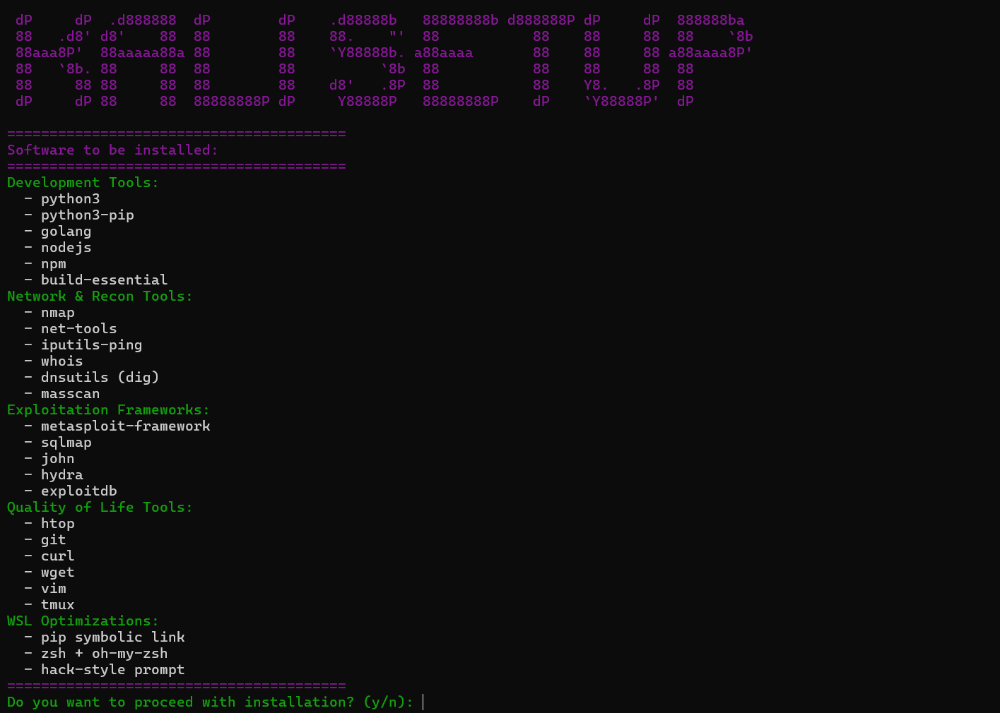

# kali-setup


kali-setup is a simple script for setting up a fresh Kali Linux (WSL) environment with common tools.

The script installs development tools, network utilities, and basic pentesting software, along with some shell configuration (zsh, oh-my-zsh).

## Installing

Run:

```bash
git clone https://github.com/zhrom/kaliWSL-setup.git
cd kali-setup
chmod +x kali-ready.sh
sudo ./kali-ready.sh
```
Or if you don't want to clone the repository, you can run the setup directly with this command:
```bash
sudo bash -c "$(curl -sSL https://raw.githubusercontent.com/zhrom/kaliWSL-setup/main/kali-ready.sh)"
```

## What it installs

* development: python3, pip, nodejs, npm, golang, build-essential
* network: nmap, net-tools, ping, whois, dnsutils, masscan
* pentesting: metasploit, sqlmap, john, hydra, exploitdb
* utilities: git, curl, wget, vim, tmux, htop

It also sets up zsh and a custom prompt.

## Notes

* requires sudo
* tested on Kali Linux (WSL)
* may work on other Debian-based systems

## Usage

The script is interactive and will ask for confirmation before installing packages.

## Contributing

No formal guidelines. Use at your own risk or modify as needed.
